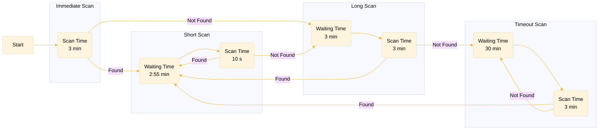

# BT_CMDQ: Bluetooth Cardiac monitoring device Q

## Description

This module focuses on the capture of bluetooth advertised data from the Cardiac monitoring device Q
(CMDQ).

The Cardiac monitoring device Q advertises over bluetooth with a burst of 8 packets every 3 minutes.
With an active scan, a scan response can be requested to get the full data. Further information
regarding the Cardiac monitoring device Q can be found
[by following this link](https://github.com/IRNAS/smartparks-opencollar-edge-fw/issues/389).

## Operation definition

The CMDQ uses 4 different scan types:

- **Immediate scan**: When starting the CMDQ operation, an immediate scan is performed, because we
  don't have any chronological data of the devices advertisement. The search interval is set to 0,
  so the scanning begins immediately.

- **Short scan**: This scan type uses the configured scan duration and search interval. The search
  interval is shortened for half the scan duration to avoid missing a scan response.

- **Long scan**: When a match is not found with a short scan a long scan is performed. A long scans
  scan duration is the configured search interval (Not to be confused with the configured
  `scan_duration`!), as we don't have any chronological data of the devices advertisement we need to
  scan for one whole advertisement cycle.

- **Scan timeout**: When a match is not found with a long scan, a configured timeout period is
  started. After expiring, a scan is performed. Scan duration is the configured search interval.

The workflow can be seen below. Note: Waiting and scanning durations can be personalized though
settings.



## Settings definition

| Setting                            | Unit              | Description                                                                                                                                                                                                                                                                                                                                   |
| ---------------------------------- | ----------------- | --------------------------------------------------------------------------------------------------------------------------------------------------------------------------------------------------------------------------------------------------------------------------------------------------------------------------------------------- |
| cmdq_enabled                       | Boolean           | Enables / Disables the CMDQ module. If disabled while scanning, stops the scan.                                                                                                                                                                                                                                                               |
| cmdq_scan_duration                 | Milliseconds      | The amount of time the module actively scans for the device while conducting a SHORT scan. It is suggested that this value is big enough so that smaller time-keeping discrepancies don't impede successful detections                                                                                                                        |
| cmdq_search_interval               | Seconds           | The amount of time the module waits in between scans. Note: when conducting an IMMEDIATE or LONG scan, the module will actively scan for this duration, because it does not have accurate chronological data. It is suggested that this setting is set to the advertisement interval of your device, to avoid missing the advertising period. |
| cmdq_on_no_detection_wait_duration | Seconds           | When the device can not detect the device with a LONG scan, it waits for the specified duration before trying again.                                                                                                                                                                                                                          |
| cmdq_reporting_interval            | Seconds           | The interval that controls how often CMDQ detections get composed into a message and sent to other messaging queues (Lora, Iridium, ...).                                                                                                                                                                                                     |
| cmdq_searched_mac_address          | Hexadecimal array | The bluetooth MAC address of your device, for which the module will search while scanning.                                                                                                                                                                                                                                                    |

### Examples

Example settings for a device that advertises every 3 minutes for 0.5s. We (ideally) report 2
detections with each port 15 message.

```c
cmdq_scan_duration: 2500
cmdq_search_interval: 180
cmdq_on_no_detection_wait_duration: 1800
cmdq_reporting_interval: 360
cmdq_searched_mac_address: [01 02 03 AB CD EF]
```

Example settings for a device that advertises every 5 minutes for 0.5s. We (ideally) report 3
detections with each port 15 message.

```c
cmdq_scan_duration: 2500
cmdq_search_interval: 300
cmdq_on_no_detection_wait_duration: 1800
cmdq_reporting_interval: 900
cmdq_searched_mac_address: [01 02 03 AB CD EF]
```

Example settings for a device that advertises every 2 minutes for 1s. We (ideally) report each
detection in its own port 15 message.

```c
cmdq_scan_duration: 5000
cmdq_search_interval: 180
cmdq_on_no_detection_wait_duration: 1800
cmdq_reporting_interval: 180
cmdq_searched_mac_address: [01 02 03 AB CD EF]
```

### Debug settings

Debugging of the module is possible with the following setting:

| Setting                              | Accepted value | Description                                                                                                                   |
| ------------------------------------ | -------------- | ----------------------------------------------------------------------------------------------------------------------------- |
| cmdq_report_zero_messages_to_be_sent | True, False    | The device will report an empty message (see example below) if in between two reporting intervals no CMDQ detection was made. |

Example settings for a CMDQ device that advertises every 2 minutes for 1s. We report faster than the
device advertises resulting in empty messages. Module settings:

```c
cmdq_report_zero_messages_to_be_sent: true

cmdq_scan_duration: 2500
cmdq_search_interval: 300
cmdq_on_no_detection_wait_duration: 1800
cmdq_reporting_interval: 100
cmdq_searched_mac_address: [01 02 03 AB CD EF]
```

## Message examples

Messaging uses the standard SP messaging protocol:

```b
<port> <message_id> <payload length> <payload>
```

The payload contains all saved CMDQ detections (buffer restrictions apply). The payload can be split
into separate detections where each detection contains a timestamp (4B) followed by important data
(9B). More information about the payload can be found
[by following this link](https://github.com/IRNAS/smartparks-opencollar-edge-fw/issues/389).

Example of a message with 1 successful detection (Hex array):

```b
0F FC 0D 58F3CD65000000000006BC0FF0
```

Example of a message with 2 successful detections (Hex array):

```b
0F FC 1a 58F3CD65000000000006BC0FF070F4CD65000000000006BC0FF0
```

Example of an empty message (Hex array). Payload length is 0:

```b
0F FC 00
```

### Payload parsing

The payload consists of a timestamp followed by important data. More information about the payload
parsing can be found
[by following this link](https://github.com/IRNAS/smartparks-opencollar-edge-fw/issues/389).

Example:

```txt
payload: 58F3CD65000000000006BC0FF0

Timestamp: 58F3CD65
Important data: 000000000006BC0FF0

Parsed data:
  "cmdq_timestamp": 1707995992

  "cmdq_rr_median": 0
  "cmdq_rr_median_modesum": 0
  "cmdq_activity_average": 0
  "cmdq_activity_max": 0
  "cmdq_active_min_in_last_hour": 0
  "cmdq_raw_temp": 1724
  "cmdq_h_impedance": 4080
```
