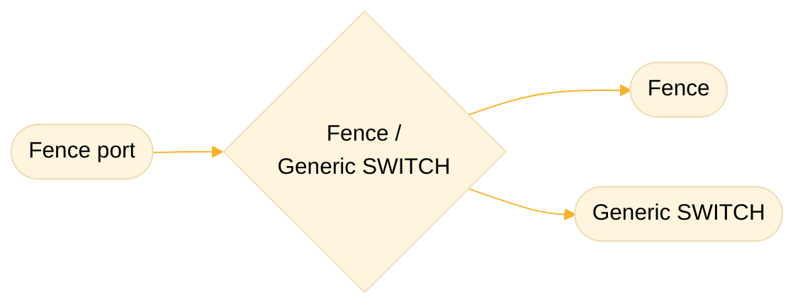

# Fence Port

The Fence port is a multi purpose interface for connecting external components or compatible sensor
boards to the tracking device. This interface is currently supported on `RangerEdge` trackers, for
hardware versions equal or higher than `1.6.0`. (`1.6.0` - `1.10.0`)

## Pin Definition

Fence port contains 4 pins:

- `AIN/GPIO` - Analog input / General purpose input - output pin
- `GPIO` - General purpose input - output pin
- `2.8V power` - 2.8 Volt power supply
- `GND` - Ground

| Pin # | Pin type     | Pin name (SCHEMA) | On-board abbreviation | Pin description                       |
| ----- | ------------ | ----------------- | --------------------- | ------------------------------------- |
| 1     | `Ground`     | `GND`             | `GND`                 | Ground                                |
| 2     | `2.8V power` | `+2.8V`           | `2.8V`                | 2.8 Volt power supply                 |
| 3     | `GPIO`       | `FENCE_EN`        | `GPIO`                | General purpose IO pin                |
| 4     | `AIN/GPIO`   | `FENCE_AN`        | `AN`                  | Analog input / General purpose IO pin |

## Current use cases

This module can be used for multiple purposes:

- [Fence](./fence/README.md)
- [Generic SWITCH](./external_switch/README.md)

More information on their specific uses and operational instructions can be found in their respected
README.md files ([Fence](./fence/README.md), [Generic SWITCH](./external_switch/README.md)).

## Workflow



Select the feature you'd like to use by enabling one of the following settings:

```json
"fence_enabled": {
    "id": "0x3F",
    "default": false,
    "min": false,
    "max": true,
    "length": 1,
    "conversion": "bool"
}
"external_switch_detection_enabled": {
    "id": "0x7E",
    "default": false,
    "min": false,
    "max": true,
    "length": 1,
    "conversion": "bool"
}
```

> [!IMPORTANT] Because both features use the same port, enabling both Fence and SWITCH
> functionalities at the same time will enable the Fence feature and disable the SWITCH feature, as
> both can not operate concurrently.

<!-- -->

> [!NOTE]REMINDER Settings can be set by sending a message to a device on port 3. Example:
>
> ```txt
> 0x3F 0x01 0x01
> ```
>
> If using the Smartparks connect app, navigate to `Actions/Management` and send the command to the
> connected device with the added port number. Example:
>
> ```txt
> 0x03 0x3F 0x01 0x01
> ```
