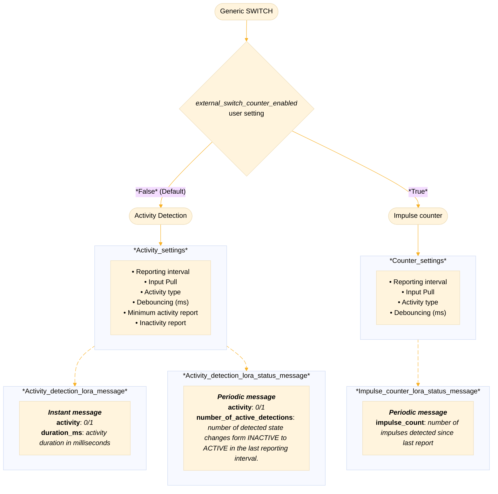

# External SWITCH Detection

This module describes a general purpose external switch detection feature, which allows the user to
connect any compatible sensor, sensor board, or simple switch to the [fence port](../README.md).

## Pin Definition

| #   | Pin (Schematic) | On-Board abbreviation | General pin description               | External SWITCH pin usage description           |
| --- | --------------- | --------------------- | ------------------------------------- | ----------------------------------------------- |
| 1   | `GND`           | `GND`                 | Ground                                | Ground                                          |
| 2   | `2.8V power`    | `2.8V`                | 2.8 Volt power supply                 | 2.8 Volt power supply                           |
| 3   | `GPIO`          | `GPIO`                | General purpose input - output pin    | GPIO output - Used for enabling external switch |
| 4   | `AIN/GPIO`      | `AN`                  | Analog input / General purpose IO pin | GPIO - input signal line                        |

## Feature Notes

### Pins

The `GPIO` output pin (#3) is enabled at feature initialization, set to high, can be used to enable
the external switch if needed.

---

### Activity detection

Activity detection will send a detection message immediately after activity is detected. After
activity was detected, as soon as inactivity is detected the device will send a message signaling
that activity has ended. The message will contain a `activity` value of 0 and a `duration_ms` value
with the total activity duration.

#### State changed message content (Port 19)

| Payload byte # | Description                                    |
| -------------- | ---------------------------------------------- |
| 0              | Message id.                                    |
| 1              | Message length                                 |
| 2              | Activity detected (True/False)                 |
| 3 - 6          | Activity / Inactivity duration in milliseconds |

#### Status message content (Port 20)

On every report period, a status message is sent to port 20

| Payload byte # | Description                                |
| -------------- | ------------------------------------------ |
| 0              | Message id.                                |
| 1              | Message length                             |
| 2              | Activity detected (True/False)             |
| 3 - 6          | Number of state changes to ACTIVE detected |

---

### Impulse counter

When sending a status report over LoRa, the impulse counter will set the activity indicator byte to
2, signaling the message is a impulse counter message.

#### Status message content (Port 20)

| Payload byte # | Description                             |
| -------------- | --------------------------------------- |
| 0              | Message id                              |
| 1              | Message length                          |
| 2              | `2` signaling a impulse counter message |
| 3 - 6          | Number of detected impulses             |

## Feature Workflow



## User Settings

External SWITCH detection uses the following user settings:

### `external_switch_detection_enabled`

Turns on external switch detection.

> [!IMPORTANT] This setting must not be enabled concurrently with the `fence_enabled`! If both are
> enabled, the firmware will automatically disable the external switch functionality.

```json
"external_switch_detection_enabled": {
    "id": "0x7E",
    "default": false,
    "min": false,
    "max": true,
    "length": 1,
    "conversion": "bool"
}
```

### `external_switch_detection_trigger_type`

Trigger type controls the way in which the device will interpret the input line signal (`AN` - GPIO
input line).

Available settings:

| #   | Description                                                                                        |
| --- | -------------------------------------------------------------------------------------------------- |
| 0   | The device will interpret a logical 0 on the `AN` (GPIO input) pin as a sign of activity           |
| 1   | The device will interpret a logical 1 on the `AN` (GPIO input) pin as a sign of activity (Default) |

```json
"external_switch_detection_trigger_type": {
    "id": "0x7F",
    "default": 1,
    "min": 0,
    "max": 1,
    "length": 1,
    "conversion": "uint8"
}
```

### `external_switch_detection_trigger_debounce_ms`

Debouncing controls how many milliseconds after detecting the `AN` (GPIO input) line changing state
the device ignores additional input state changes.

> [!NOTE]Activity detection specific After the debouncing period expires, the device will read the
> state of the `AN` (GPIO input) line again, confirming that the state is correctly set. This is
> done to fix the issue where the input line changed state prior to the debouncing duration
> expiring, resulting in the device reporting activity incorrectly.

<!-- -->

> [!WARNING] Setting debouncing to 0 will turn `OFF` the debouncing logic, which can slow down the
> device and potentially make it unusable, if the input GPIO pin is floating or in a pull mismatch.

```json
"external_switch_detection_trigger_debounce_ms": {
    "id": "0x80",
    "default": 50,
    "min": 0,
    "max": 2000,
    "length": 2,
    "conversion": "uint16"
}
```

### `external_switch_detection_reporting_interval`

Reporting interval at which a report is sent over LoRa. Setting the interval to 0 will disable it.

> [!IMPORTANT]Activity detection specific
>
> This setting only controls the periodic status reporting. When activity was detected after a
> period of inactivity (or when going from a period of activity to inactivity), the device will
> instantly send a message over LoRa, even if the reporting interval is set to 0.

```json
"external_switch_detection_reporting_interval": {
    "id": "0x81",
    "default": 0,
    "min": 0,
    "max": 86400,
    "length": 4,
    "conversion": "uint32"
}
```

### `external_switch_send_inactivity_report`

Enabling this setting will allow the device to send report of inactivity when
`external_switch_detection_reporting_interval` expires.

```json
"external_switch_send_inactivity_report": {
    "id": "0x82",
    "default": true,
    "min": false,
    "max": true,
    "length": 1,
    "conversion": "bool"
}
```

### `external_switch_minimal_report_duration_ms`

To avoid filling up the LoRa queue with detections that slip past the debouncing period, this
setting allows users to select a minimal duration the external switch needs to detect activity
before sending a report over LoRa.

```json
"external_switch_minimal_report_duration_ms": {
    "id": "0x83",
    "default": 250,
    "min": 0,
    "max": 65000,
    "length": 2,
    "conversion": "uint16"
}
```

### `external_switch_input_pull`

Set this pull of the `AN` (GPIO input) line for more accurate activity and counting measurements.

| #   | Description |
| --- | ----------- |
| 0   | No pull     |
| 1   | Pull Up     |
| 2   | Pull Down   |

> [!WARNING] If your external switch already adds pull to the input line, setting this setting
> incorrectly could result in increased power consumption and other undefined behavior.

```json
"external_switch_input_pull": {
    "id": "0x84",
    "default": 0,
    "min": 0,
    "max": 2,
    "length": 1,
    "conversion": "uint8"
}
```

### `external_switch_counter_enabled`

Toggle between switch activity detection and impulse counter.

Enabling this setting will change the external switch detection behavior from activity detection to
impulse counting. The device will (based on `external_switch_detection_trigger_type`) count the
number of detected state changes to activity. The device counts how many times the state changed
from a state of inactivity to activity (ignoring state changes inside of the debounce interval)
inside of the reporting interval `external_switch_detection_reporting_interval`.

```json
"external_switch_counter_enabled": {
    "id": "0x85",
    "default": false,
    "min": false,
    "max": true,
    "length": 1,
    "conversion": "bool"
}
```
